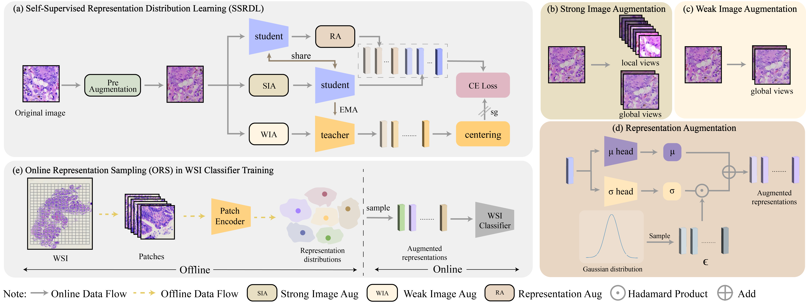

# SSRDL
## Self-Supervised Representation Distribution Learning for Reliable Data Augmentation in Histopathology WSI Classification

Kunming Tang, Zhiguo Jiang, Kun Wu, Jun Shi, Fengying Xie, Wei Wang, Haibo Wu, Yushan Zheng

## Framework Overview

<p align="center">
     <br>

  *Overview of SSRDL architecture*

</p>


### Pre-train

Run the codes on the slurm with multiple GPUs:
```
#!/bin/bash

#SBATCH --gres=gpu:2
#SBATCH -N 1
#SBATCH -p gpu
#SBATCH -c 24

source activate
conda activate pytorch

srun -u python -m torch.distributed.launch --nproc_per_node=2 main_pretrain.py \
    --arch vit_small \
    --data_path ./data/TCGA_EGFR \
    --data_file train.txt \
    --output_dir ./checkpoint/ssrdl_tcga_egfr \
    --batch_size_per_gpu 64 \
    --num_workers 12 \
    --epochs 50 \
    --saveckp_freq 1 \
    --warmup_epochs 10 \
    --use_fp16 True \
```

### Patch feature extract
```
#!/bin/bash

#SBATCH --gres=gpu:2
#SBATCH -N 1
#SBATCH -p gpu
#SBATCH -c 24
#SBATCH -o extract_egfr.log

source activate
conda activate pytorch

srun python extract_features.py \
    --arch vit_small \
    --imsize 224 \
    --step 224 \
    --feat-dim 384 \
    --max-nodes 4096 \
    --slide-dir ./medical_data/TCGA_EGFR \
    --feat-dir ./feat/TCGA_EGFR \
    --list-dir ./dataset/TCGA_EGFR \
    --slide-list TCGA_EGFR_2cls \
    --num-workers 24 \
    --batch-size 256 \
    --multiprocessing-distributed \
    --cl ssrdl \
    --ckp-path ./checkpoint/TCGA_EGFR/ssrdl_tcga_egfr/checkpoint0049.pth \
    
```

### WSI classifier training
```
#!/bin/bash

#SBATCH --gres=gpu:2
#SBATCH -N 1
#SBATCH -p com
#SBATCH -c 24

source activate
conda activate pytorch

srun -u python main.py \
    --num_classes 2 \
    --exp_code clam_mb_ssrdl_tcga_egfr \
    --data-dir ./feat/TCGA_EGFR/[vit_small_ssrdl][fs224fts384] \
    --list-dir ./dataset/TCGA_EGFR \
    --slide-list TCGA_EGFR_2cls \
    --train-list TCGA_EGFR_2cls_train_split.csv \
    --model clam_mb \
    --feats_size 384 \
    --aug \ 
    --status dist \
```

If the code is helpful to your research, please cite:
```bibtex
@ARTICLE{tang2024self,
  author={Tang, Kunming and Jiang, Zhiguo and Wu, Kun and Shi, Jun and Xie, Fengying and Wang, Wei and Wu, Haibo and Zheng, Yushan},
  journal={IEEE Transactions on Medical Imaging}, 
  title={Self-Supervised Representation Distribution Learning for Reliable Data Augmentation in Histopathology WSI Classification}, 
  year={2024},
  volume={},
  number={},
  pages={1-1},
  keywords={Data augmentation;Training;Representation learning;Data models;Histopathology;Feature extraction;Supervised learning;Self-supervised Representation Learning;Data Augmentation;WSI Classification},
  doi={10.1109/TMI.2024.3447672}}
```